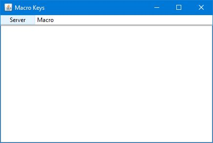
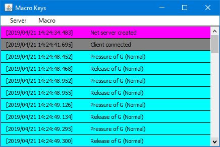

<br/>

<div align="center">
    <a href="https://simonecorazza.github.io/MacroKeys/">
        
    </a>
</div>

# MacroKeys Server &middot; [](https://travis-ci.org/SimoneCorazza/MacroKeysServer) [](https://sonarcloud.io/dashboard?id=com.macrokeys%3Amacro-key-server)

Cross platform desktop MacroKeys server.

<div>



</div>

## Features

- Receive macro keys from the [Android App](https://github.com/SimoneCorazza/MacroKeysAndroid)
- Communicate with Bluetooth and Wifi
- Customize your keyboards with the [editor](https://github.com/SimoneCorazza/MacroKeysEditor)
- Trace every keystroke sent
- Encrypted protocol for added layer of security

## How To Use

1. Install the server, the [editor](https://github.com/SimoneCorazza/MacroKeysEditor) and the [Android App](https://github.com/SimoneCorazza/MacroKeysAndroid)
1. Create a MacroKeys using the **editor**
4. Connect the **client app** to the **server** (using Bluetooth or Wifi)
5. Start sending keystrokes to the server

## Build from source

### Prerequisites

This project is built with [maven](https://maven.apache.org/) so you need to install the [maven cli](https://maven.apache.org/download.cgi) to run it.

### Executing

To execute simply use

```
mvn exec:java
```

### Packaging

```
mvn package
```

The output `.jar` is in the `./target` directory.

## License

This project is licensed under the GPL License see the [LICENSE.md](LICENSE.md) file for details
